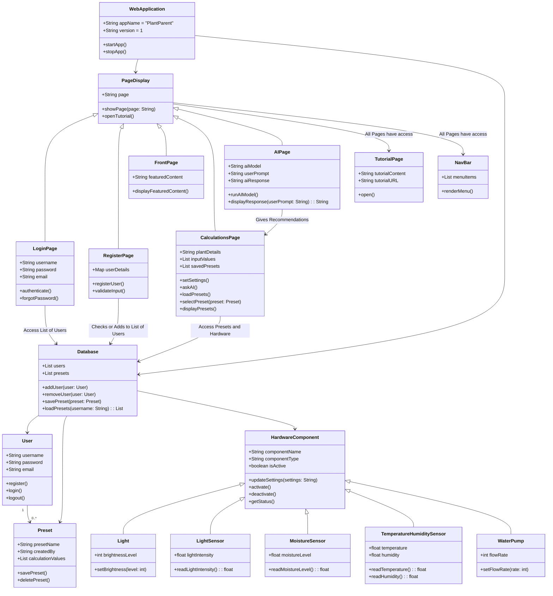

# Class Diagram

# Descriptions of Each Class

### WebApplication
Manages the core functionality of the PlantParent app, with features to start and stop the application. It connects to both the page display and the database for managing the system.

### PageDisplay
Controls the visual interface of the app, displaying different pages such as the front page, calculation settings, AI recommendations, login, and register. It can also open the tutorial.

### FrontPage
Displays the featured content on the application’s homepage, showcasing primary information.

### CalculationsPage
Handles settings for plant care, allowing the user to input data, interact with saved presets, and request AI recommendations. It also manages settings for connected hardware.

### AIPage
Manages AI interactions, running the AI model based on user input and providing responses. It connects with the calculations page to give plant care advice.

### LoginPage
Authenticates users through their login credentials, with options for password recovery.

### RegisterPage
Registers new users by collecting and validating their details, and storing them in the database.

### NavBar
Renders a menu for navigating between the different pages in the application.

### TutorialPage
Displays instructional content, guiding users through app functionality and linking to external tutorials.

### User
Represents a user of the application, managing registration, login, and logout actions.

### Preset
Stores preset plant care configurations, allowing users to save and delete personalized settings.

### Database
Stores users, presets, and hardware components, facilitating data retrieval and storage for the application.

### HardwareComponent
Represents the different hardware devices used in the app, with functionality to activate, deactivate, and update settings.

### Light
A type of hardware component controlling the brightness level of a light source.

### LightSensor
A sensor hardware component that reads and returns the light intensity level.

### MoistureSensor
Reads and returns the soil moisture level for plant care.

### TemperatureHumiditySensor
Measures and reports the temperature and humidity levels in the environment.

### WaterPump
A component controlling the water flow rate to manage irrigation for the plants.

