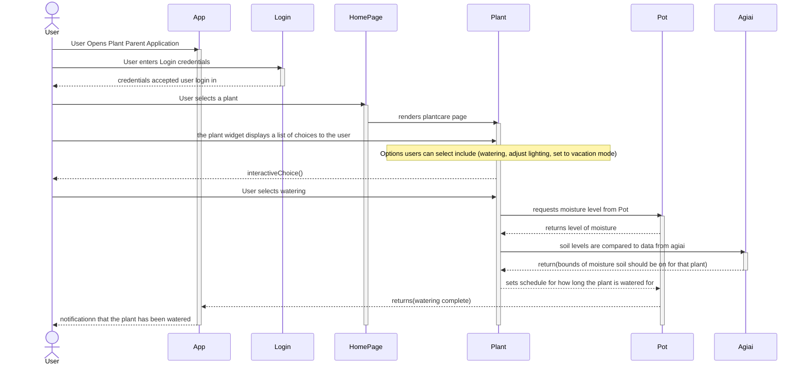
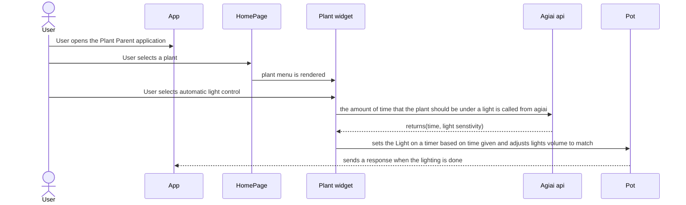

# Sequence Diagrams
## Use Case 1
### A user wants to keep plants watered while away on vacation

  1. Upon opening the application, the user is sent to the login in screen
  2. After the user login in they are directed to the home page
  3. From the home page user selects a plant that has already been added to their collection
  4. User is taken into the plant care widget, from there they are able to select from a few options
  5. User chooses to put the plant on a watering cycle
  6. The application grabs data provided by the AGIai api on how much the plant should be watered bases on soil readings
  7. Application sets a watering schedule and sends that to the watering device
  8. after watering is complete user receives a notification
## Use Case 2
### A user has plants that need to be kept under light for a certain amount of time

  1. User opens application, and is taken to home page
  2. User selects plant from their collection
  3. User selects lighting from the plant care widget
  4. Data for how long the plant should be under light is pulled from agiai
  5. The app sets a schedule to turn on and off the lights
  6. App sends a message to the light controller in the pot to turn on and off as needed
  7. Notification is sent to user when the lighting cycle is complete
