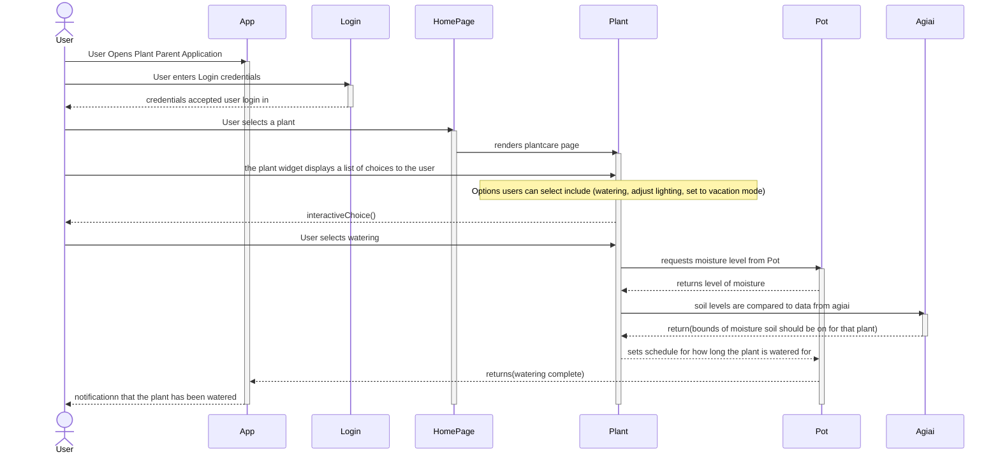
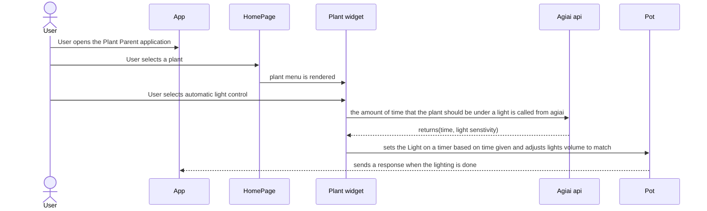
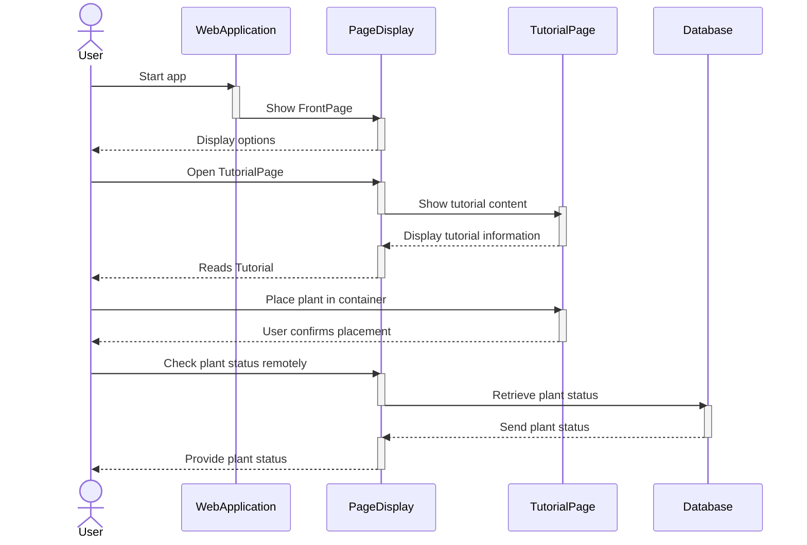
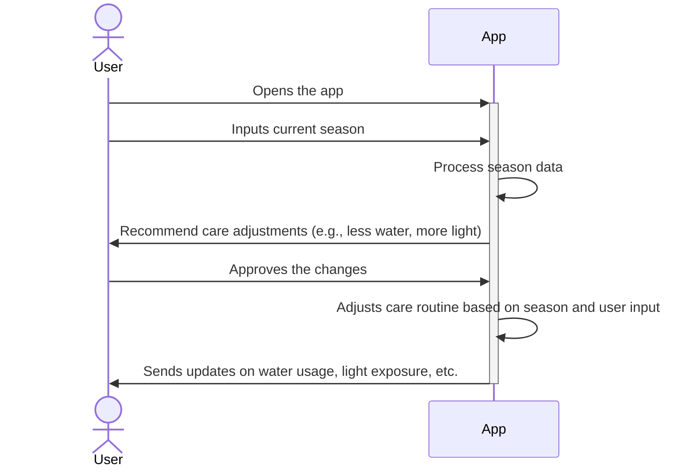

# Sequence Diagrams
## Use Case 1
### A user wants to keep plants watered while away on vacation


  1. Upon opening the application, the user is sent to the login in screen
  2. After the user login in they are directed to the home page
  3. From the home page user selects a plant that has already been added to their collection
  4. User is taken into the plant care widget, from there they are able to select from a few options
  5. User chooses to put the plant on a watering cycle
  6. The application grabs data provided by the AGIai api on how much the plant should be watered bases on soil readings
  7. Application sets a watering schedule and sends that to the watering device
  8. after watering is complete user receives a notification
## Use Case 2
### A user has plants that need to be kept under light for a certain amount of time

  1. User opens application, and is taken to home page
  2. User selects plant from their collection
  3. User selects lighting from the plant care widget
  4. Data for how long the plant should be under light is pulled from agiai
  5. The app sets a schedule to turn on and off the lights
  6. App sends a message to the light controller in the pot to turn on and off as needed
  7. Notification is sent to user when the lighting cycle is complete


## Use Case 5
### A user wants to keep the plant safe from the outside environment

1. User follows guidelines on how to place plant within container
2. User places container with plant inside a home or safe space
3. User can take care of plant remotely while also knowing it’s in a safe place

  

## Use Case 8 - Changing Care Schedule Based on Seasonal Change
A user wants to change their plant care schedule due to a seasonal change.



1. The user inputs the current season based on the date.
2. The app recommends adjustments for plant care, such as less water or more light.
3. The user checks and approves the changes.
4. The app adjusts its routine according to the season and user input.
5. The app provides updates on water usage, light exposure, and other changes.


## Use Case 9 - Assisting a Beginner in Plant Care
A user has never had experience with plant care before and is unsure how to start.


    ```mermaid
   sequenceDiagram
    actor User
    activate App
    User->>App: Opens the app
    User->>App: Accesses the AI chat box
   activate AI
    User->>AI: Enters background information and experience
    AI->>User: Delivers personalized care plan
    AI->>User: Provides advice and tips
   deactivate AI
    User->>App: Enables notifications
   deactivate App

   ```
1. The user opens the app.
2. The user accesses the AI chat box.
3. The user enters their background information and any experience with plants to the AI.
4. The chat delivers a personalized care plan.
5. The chat also provides advice and tips for plant care.
6. The user can enable notifications for reminders.
  
