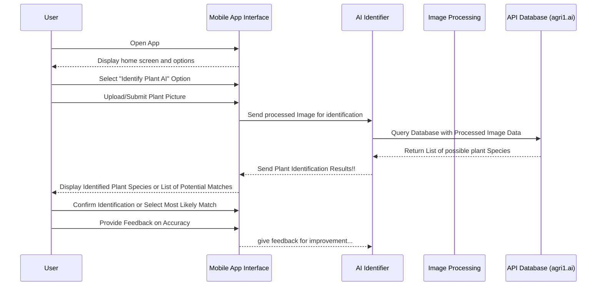
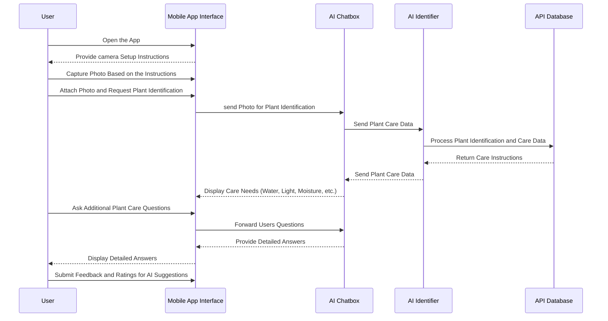
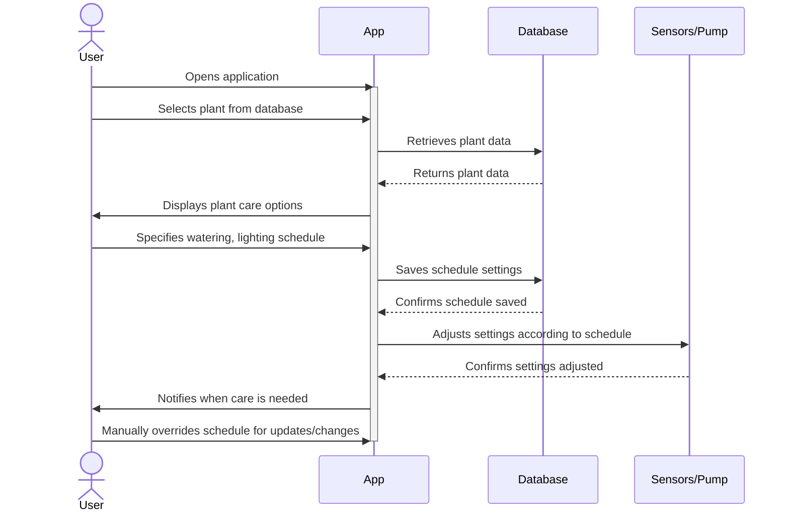
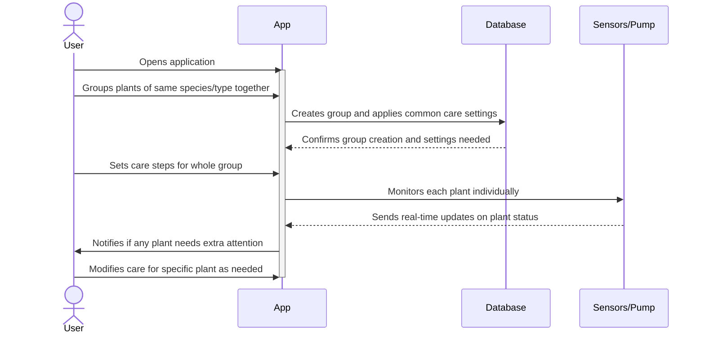
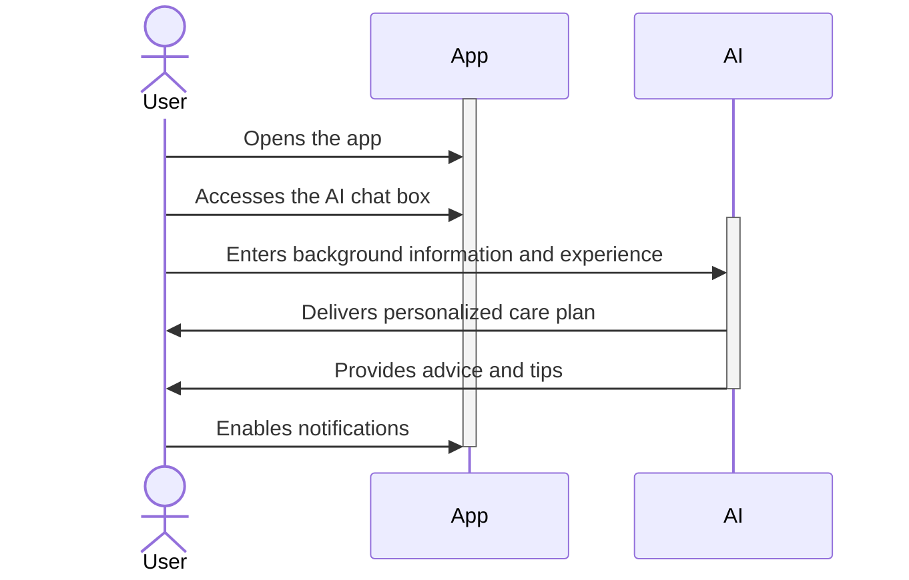

# Sequence Diagrams
## Use Case 1
### A user wants to keep plants watered while away on vacation

  1. Upon opening the application, the user is sent to the login in screen
  2. After the user login in they are directed to the home page
  3. From the home page user selects a plant that has already been added to their collection
  4. User is taken into the plant care widget, from there they are able to select from a few options
  5. User chooses to put the plant on a watering cycle
  6. The application grabs data provided by the AGIai api on how much the plant should be watered bases on soil readings
  7. Application sets a watering schedule and sends that to the watering device
  8. after watering is complete user receives a notification

## Use Case 2
### A user has plants that need to be kept under light for a certain amount of time

  1. User opens application, and is taken to home page
  2. User selects plant from their collection
  3. User selects lighting from the plant care widget
  4. Data for how long the plant should be under light is pulled from agiai
  5. The app sets a schedule to turn on and off the lights
  6. App sends a message to the light controller in the pot to turn on and off as needed
  7. Notification is sent to user when the lighting cycle is complete

## Use Case 3
### A user is unclear on a certain plant type and needs help identifying the plant species growing

1. User opens the app and is taken to the home screen.
2. User selects the "Help Identifying a Plant? Ask AI!" option and uploads a plant picture.
3. The processed image is sent to the AI Identifier for plant identification.
4. The AI Identifier queries agri1.ai database for possible plant matches and identification data.
5. The app displays the identified plant species. 
6. The user confirms or provides feedback to improve accuracy.

## Use Case 4
### A user wants to learn how to take care of plants through the AI

1. User opens the app and follows the camera setup instructions displayed by the app.
2. The user captures a photo of the plant based on the instructions and submits it for identification.
3. The mobile app sends the plant photo to the AI Chatbox, which forwards it to the AI Identifier. The AI Identifier processes the image using the API Database and returns the plant care instructions.
4. The mobile app displays the plant care needs (e.g., water, light, moisture) to the user.
5. The user asks additional plant care questions, and the AI Chatbox provides detailed answers. The user submits feedback and ratings for the AI's suggestions.
   
## Use Case 5
### A user wants to keep the plant safe from the outside environment

1. User follows guidelines on how to place plant within container
2. User places container with plant inside a home or safe space
3. User can take care of plant remotely while also knowing it’s in a safe place

## Use Case 6 - Custom Schedule for Specific Plant
A user wants to custom schedule for taking care of a specific plant

1. User selects a plant from the database
2. App shows a visual calendar building a schedule
3. User specifies the necessary watering, lighting, and control schedule
4. App saves the schedule and automatically adjusts setting with the specified times
5. User receives notifications when the plant needs care based on the schedule

## Use Case 7 - Grouping Species/Type Together
### A user has plants of the same species/type that they want to manage as a group

1. User groups the same type together in the app
2. User sets common care steps for the entire group
3. App monitors each plant individually but gives the same settings for whole group
4. App notifies the user if any plant needs extra attention in the group

## Use Case 8 - Changing Care Schedule Based on Seasonal Change
### A user wants to change their plant care schedule due to a seasonal change.

1. The user inputs the current season based on the date.
2. The app recommends adjustments for plant care, such as less water or more light.
3. The user checks and approves the changes.
4. The app adjusts its routine according to the season and user input.
5. The app provides updates on water usage, light exposure, and other changes.

## Use Case 9 - Assisting a Beginner in Plant Care
### A user has never had experience with plant care before and is unsure how to start.

1. The user opens the app.
2. The user accesses the AI chat box.
3. The user enters their background information and any experience with plants to the AI.
4. The chat delivers a personalized care plan.
5. The chat also provides advice and tips for plant care.
6. The user can enable notifications for reminders.
  
